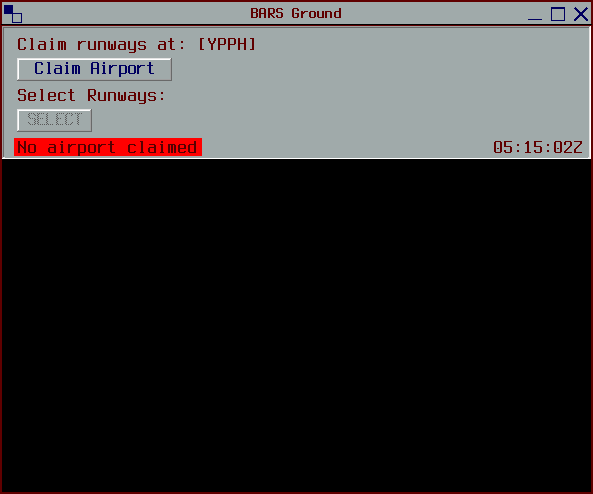
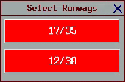
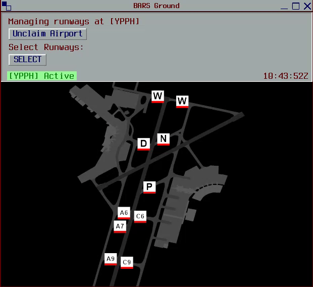
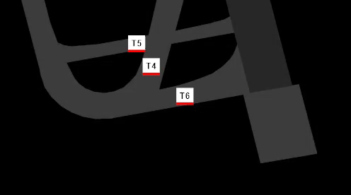
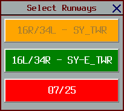

--8<-- "includes/abbreviations.md"

In the real world, aerodrome controllers use stopbars as a bar of illuminated lights preventing aircraft from entering active runways. Within vatSys, this can be emulated using the [BARS Ground plugin](https://github.com). Stopbar state is shared between controllers and pilots participating in the plugin.

!!! warning "Important"  
    BARS Ground can be an incredibly useful tool to simulate the use of stopbars, but it's use is **not compulsory**. Controllers should revert to the default vatSys usage if the use of BARS Ground is becoming a hinderance to themselve.

!!! note
    Stopbars are positioned at runways, which by default are under the sole jurisdiction of ADC controllers. BARS Ground's stopbar functionality should only be utilised by **Tower (S2) or Approach (S3) controllers**.

## Setup

### Installation  
The BARS Ground plugin can be installed through [Github](https://github.com){target=new}. If the client is installed correctly, and your position is selected at a [compatible airport](#compatible-airports), there will be an BARS option in the Window dropdown menu of vatSys.

### Connection
After launching vatSys, the BARS Ground plugin will automatically open. To get started, click the "Claim Airport" button. Additionally, within the control bar a status message will display important information of the current state. This status message will show if the airport is claimed, and what runways, if any are claimed. 

<figure markdown>
{ width="500" }
    <figcaption>BARS Ground Connection</figcaption>
</figure>

### Select Runways
After claiming the airport, controllers **must** choose the active runways. Selecting a runway claims its stopbars for only you, and only those runways will appear on the BARS Ground map. Unselected runways will have their stopbars turn green automatically. For operations where multiple ADC controllers are present, see [Duel ADC Positions](#duel-adc-positions).

<figure markdown>
{ width="400" }
    <figcaption>BARS Selecting Runways</figcaption>
</figure>

### Control Bar

Once the control bar has been successfully configured, click just above the ground map to minimize it. This action reduces the control bar's size, freeing up additional screen space while still retaining key information at the top, such as connection status, and the current Zulu time.

<figure markdown>
{ width="500" }
    <figcaption>BARS Control Bar</figcaption>
</figure>

## Compatible Airports

- YBBN
- YSSY
- YSCB
- YMML
- YPPH

## Stopbar Usage

Aircraft on the maneuvering area must stop and hold at all illuminated stopbars, proceeding only after receiving clearance. Once clearance to enter or cross a runway is given, click on the corresponding stopbar to allow the aircraft to proceed. After the aircraft clears the area, click on the stopbar again to reactivate it.

<figure markdown>
{ width="500" }
    <figcaption>BARS Stopbar</figcaption>
</figure>

!!! Example
    **VOZ832:** "Sydney Tower, VOZ832, ready"  
    **SY ADC:** "VOZ832, Sydney Tower, Runway 34R, cleared for takeoff"  
    **VOZ832:** "Runway 34R, cleared for takeoff, VOZ832"  

    *SY ADC drops the stopbar, VOZ832 enters the runway, SY ADC reactivates the stopbar*

## Runway Crossing

After coordination has been complete for aircraft to cross a duty runway, it is ADC's responsibility to drop the stopbar at the relevant crossing point, then reactivate the stopbar once the crossing is complete.

## Duel ADC Positions

If multiple ADC controllers are present at one airport, each controller will be able to claim the runway within their respective jurisdiction through the [select runways](#select-runways) menu. Once a runway has been claimed, other controllers will no longer be able to claim it.

<figure markdown>
{ width="330 " }
    <figcaption>BARS Duel ADC</figcaption>
</figure>
